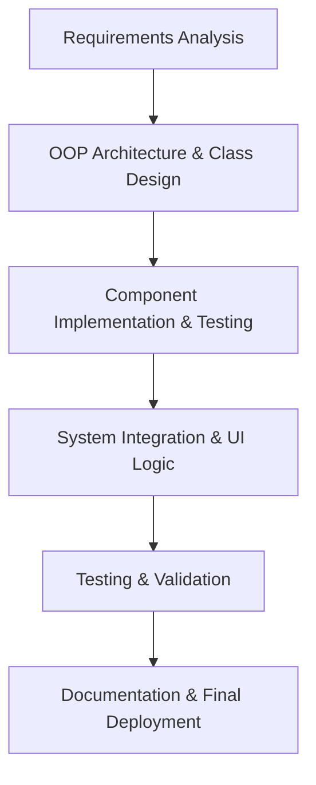
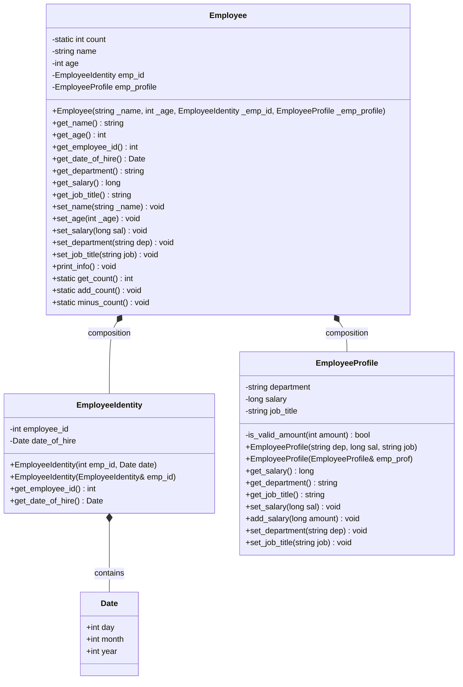
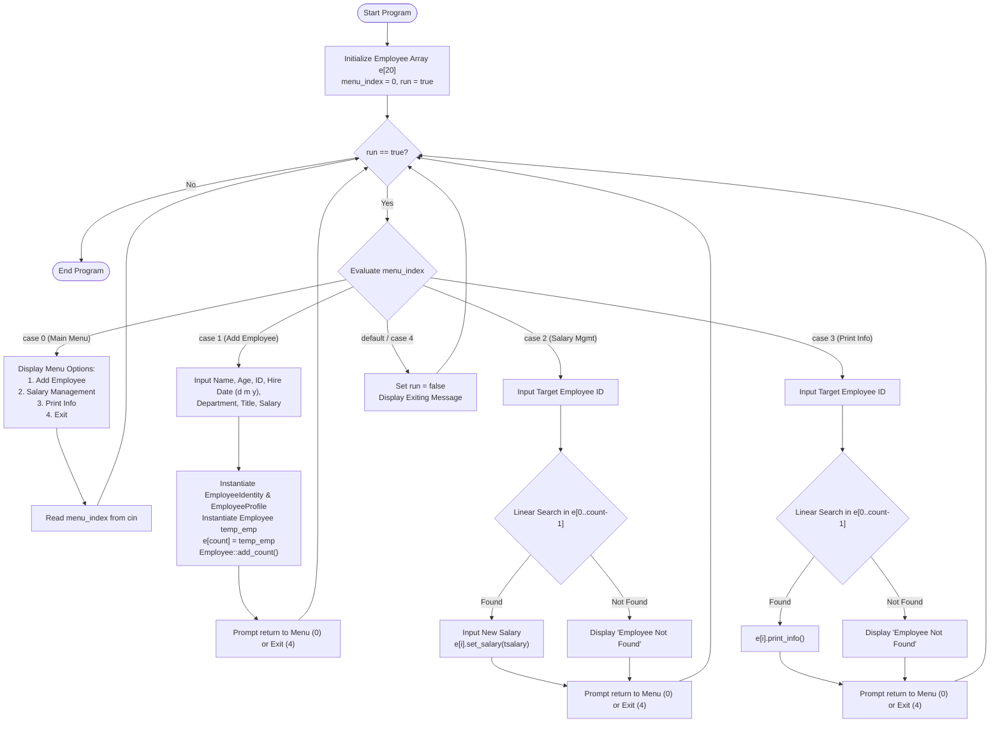

# Project Documentation: Employee Management System
**Course:** Object-Oriented Programming with C++ (B.Tech CSE - 2nd Year / Sem 3)  
**Language:** C++ (C++11/C++17)  
**Source File:** `employee.cpp`  

---

## 1. Introduction

### 1.1 Project Overview
The **Employee Management System (EMS)** is a console-based application implemented in C++ demonstrating core Object-Oriented Programming (OOP) principles. It is designed to assist human resource (HR) administrators in maintaining records of employees within an organization. The application manages employee identities, professional profiles, hire dates, departmental allocations, and salary modifications through an interactive, menu-driven interface.

### 1.2 Purpose and Objectives
- **Centralized Data Record:** Provide an organized in-memory database to store and manage employee records.
- **Data Encapsulation:** Protect sensitive attributes (such as employee IDs, salary details, and department allocations) from unauthorized or inconsistent direct modifications.
- **Demonstrate Core OOP Paradigms:** Implement concepts such as **Classes & Objects**, **Constructors & Constructor Initialization Lists**, **Composition**, **Data Hiding (Access Specifiers)**, and **Static Data Members & Member Functions**.

### 1.3 Scope of the System
- Manage up to a predefined capacity of active employee records in memory.
- Enable user operations: Adding a new employee, updating salaries, looking up employee details by ID, and graceful system termination.
- Validate inputs (e.g., non-negative salary increments and updates).

---

### 1.4 Requirements Specification

#### 1.4.1 Functional Requirements (FR)
1. **FR-1: Employee Registration (Add Employee)**
   - The system must capture basic details: Full Name, Age.
   - The system must create and associate an `EmployeeIdentity` containing a unique Employee ID and Hire Date (Day, Month, Year).
   - The system must create and associate an `EmployeeProfile` containing Department, Job Title, and Initial Salary.
   - The system must increment the total count of active employees upon registration.
2. **FR-2: Salary Management (Update / Modify Salary)**
   - The system must allow searching for an employee using their unique `Employee ID`.
   - If found, the system must allow the admin to input a new salary value.
   - The system must validate that the entered salary is positive (> 0) before committing changes.
3. **FR-3: Employee Record Lookup & Display**
   - The system must locate an employee by `Employee ID`.
   - The system must format and display all stored attributes: Name, Age, Salary, Department, and Job Title.
4. **FR-4: Console Interface & Navigation**
   - The system must present a clear top-level menu with selectable options (1 to 4).
   - The user must be able to return to the main menu or exit the program at any stage.

#### 1.4.2 Non-Functional Requirements (NFR)
1. **Modularity & Maintainability:** Structured using distinct classes (`Date`, `EmployeeIdentity`, `EmployeeProfile`, `Employee`) to ensure low coupling and high cohesion.
2. **Robustness & Validation:** Validation methods (e.g., `is_valid_amount()`) ensure that corrupt or negative financial values are rejected.
3. **Performance & Efficiency:** Operates in constant $O(1)$ time for insertion and linear $O(N)$ time for search queries across in-memory records.
4. **Portability:** Standard ANSI/ISO C++ code compilable via any standard C++ compiler (`g++`, `clang++`, MSVC) on Windows and Linux/macOS environments.

#### 1.4.3 Hardware & Software Requirements
- **Operating System:** Windows 10/11, Linux (Ubuntu/Debian), or macOS
- **Compiler:** GCC / MinGW (`g++` >= 7.0) or Clang or MSVC
- **Processor:** Minimum 1.0 GHz x86/x64 processor
- **Memory (RAM):** Minimum 512 MB
- **Storage:** < 10 MB free disk space

---

## 2. Planning

### 2.1 Software Development Life Cycle (SDLC) Methodology
The project adopted the **Iterative Waterfall Model**, allowing staged progression through requirement gathering, modular design, component coding, integration, and verification.



### 2.2 Project Phases & Milestones

| Milestone | Phase | Description | Deliverable |
| :--- | :--- | :--- | :--- |
| **M1** | **Requirement Definition** | Identification of employee attributes and business rules | Requirements specification |
| **M2** | **Object-Oriented Design** | Designing structs, helper functions, and class boundaries | UML Class Diagram & Flowchart |
| **M3** | **Module Coding** | Implementing `Date`, `EmployeeIdentity`, and `EmployeeProfile` | Tested isolated components |
| **M4** | **Composite Class & CLI** | Implementing `Employee` and `main()` menu loop | Working console executable |
| **M5** | **Testing & Documentation** | Boundary condition checks and report preparation | Final Project Documentation |

---

## 3. Analysis

### 3.1 Problem Statement
Traditional paper-based or unstructured flat-file systems for staff record management suffer from data redundancy, lack of encapsulation, accidental data modification, and inefficient lookup processes. A structured Object-Oriented software solution is required to model the entities cleanly while maintaining separation of concerns between an employee's personal identity and their job profile.

### 3.2 Feasibility Study
- **Technical Feasibility:** The project uses standard C++ OOP features without relying on external heavyweight libraries, ensuring zero external dependencies.
- **Operational Feasibility:** The interactive console UI is intuitive and requires minimal training for an administrative operator.
- **Economic Feasibility:** Built entirely with open-source toolchains (GCC / MinGW / VS Code), incurring zero licensing costs.

### 3.3 Object-Oriented Analysis (OOA)
The domain is decomposed into modular entities:
1. **`Date` (Data Structure):** Encapsulates day, month, and year values.
2. **`EmployeeIdentity` (Entity Class):** Encapsulates immutable or identity-specific attributes (Employee ID and Hire Date).
3. **`EmployeeProfile` (Entity Class):** Encapsulates organizational role details (Department, Job Title, Salary) along with business validation rules.
4. **`Employee` (Composite Class):** Acts as the master aggregate entity combining personal demographics (`name`, `age`) with composition of `EmployeeIdentity` and `EmployeeProfile`.

---

## 4. Design & Flowchart Workflow

### 4.1 Class Diagram (UML)



---

### 4.2 System Execution Flowchart



---

## 5. Implementation & Coding

### 5.1 Key OOP Concepts Applied
1. **Composition (Has-A Relationship):**
   - The `Employee` class contains instances of `EmployeeIdentity` and `EmployeeProfile` as its private member fields.
   - This design enforces high modularity: identity logic is isolated from compensation/job logic.
2. **Data Hiding & Encapsulation:**
   - Class state attributes (`employee_id`, `salary`, `name`, etc.) are declared `private`.
   - Access and mutations are governed via public getter and setter methods.
3. **Static Class Members:**
   - `static int count`: Maintains global count across all employee instances.
   - `static int get_count()`, `static void add_count()`, `static void minus_count()`: Allow tracking active records without depending on a specific instance.
4. **Constructor Member Initializer Lists:**
   - Utilized for fast and direct initialization of primitive and nested composite objects:
   ```cpp
   EmployeeIdentity(int emp_id = 0, Date date = {0, 0, 0})
       : employee_id(emp_id), date_of_hire(date) {}
   ```
5. **Copy Constructors:**
   - Implemented in `EmployeeIdentity` and `EmployeeProfile` to enable safe copying and assignment operations when transferring objects to the array.

---

### 5.2 Critical Code Components

#### Module 1: `Date` Struct & Helper Utilities
```cpp
struct Date {
    int day;
    int month;
    int year;
};

void clear_screen() {
    system("cls");
}

void print_title(string title) {
    int n = 5;
    for (int i = 0; i < n; i++) cout << "-";
    cout << title;
    for (int i = 0; i < n; i++) cout << "-";
    cout << endl;
}
```

#### Module 2: `EmployeeIdentity` Class
```cpp
class EmployeeIdentity {
private:
    int employee_id;
    Date date_of_hire;

public:
    EmployeeIdentity(int emp_id = 0, Date date = {0, 0, 0})
        : employee_id(emp_id), date_of_hire(date) {}

    EmployeeIdentity(EmployeeIdentity& emp_id) {
        employee_id = emp_id.employee_id;
        date_of_hire = emp_id.date_of_hire;
    }

    int get_employee_id() const { return employee_id; }
    Date get_date_of_hire() const { return date_of_hire; }
};
```

#### Module 3: `EmployeeProfile` Class
```cpp
class EmployeeProfile {
private:
    string department;
    long salary;
    string job_title;

    bool is_valid_amount(int amount) {
        if (amount > 0) return true;
        cout << "Entered an invalid amount." << endl;
        return false;
    }

public:
    EmployeeProfile(string dep = "Unknown", long sal = 0, string job = "Unknown")
        : department(dep), salary(sal), job_title(job) {}

    EmployeeProfile(EmployeeProfile& emp_prof) {
        department = emp_prof.department;
        salary = emp_prof.salary;
        job_title = emp_prof.job_title;
    }

    long get_salary() const { return salary; }
    string get_department() const { return department; }
    string get_job_title() const { return job_title; }

    void set_salary(long sal) {
        if (is_valid_amount(sal)) salary = sal;
    }

    void add_salary(long amount) {
        if (is_valid_amount(amount)) salary += amount;
    }

    void set_department(string dep) { department = dep; }
    void set_job_title(string job) { job_title = job; }
};
```

#### Module 4: Composite `Employee` Class
```cpp
class Employee {
private:
    static int count;
    string name;
    int age;
    EmployeeIdentity emp_id;
    EmployeeProfile emp_profile;

public:
    Employee(string _name = "Unknown", int _age = 0, 
             EmployeeIdentity _emp_id = EmployeeIdentity(), 
             EmployeeProfile _emp_profile = EmployeeProfile())
        : name(_name), age(_age), emp_id(_emp_id), emp_profile(_emp_profile) {}

    string get_name() const { return name; }
    int get_age() const { return age; }
    int get_employee_id() const { return emp_id.get_employee_id(); }
    Date get_date_of_hire() const { return emp_id.get_date_of_hire(); }
    string get_department() const { return emp_profile.get_department(); }
    long get_salary() const { return emp_profile.get_salary(); }
    string get_job_title() const { return emp_profile.get_job_title(); }
    
    static int get_count() { return count; }
    static void add_count() { count++; }
    static void minus_count() { count--; }

    void set_name(string _name) { name = _name; }
    void set_age(int _age) { age = _age; }
    void set_salary(long sal) { emp_profile.set_salary(sal); }
    void set_department(string dep) { emp_profile.set_department(dep); }
    void set_job_title(string job) { emp_profile.set_job_title(job); }

    void print_info() const {
        cout << "Name: " << name << endl;
        cout << "Age: " << age << endl;
        cout << "Salary: " << this->get_salary() << endl;
        cout << "Department: " << this->get_department() << endl;
        cout << "Job_Title: " << this->get_job_title() << endl;
    }
};

int Employee::count = 0;
```

---

### 5.3 Sample Execution Runs

#### Sample Test 1: Adding a New Employee
```text
-----Adding Employee Information-----
Enter Employee Name(No spaces): JohnDoe
Enter Employee Age: 28
Enter Employee Id: 101
Enter Date of Hire (Format-> dd mm yy): 15 08 2023
Enter the Department(No spaces): Engineering
Enter the Job Title(No spaces): SoftwareEngineer
Enter the salary: 75000
Employee Information Added

Enter 0 to Main Menu or 4 to exit: 0
```

#### Sample Test 2: Viewing Employee Records
```text
-----Print Employee Information-----
Enter the EmployeeID: 101
Employee Found!

Name: JohnDoe
Age: 28
Salary: 75000
Department: Engineering
Job_Title: SoftwareEngineer

Enter 0 to Main Menu or 4 to exit: 0
```

#### Sample Test 3: Updating Salary
```text
-----Salary Management-----
Enter the EmployeeID: 101
Employee Found!

Name: JohnDoe
Enter the new Salary: 
85000
Salary Updated!

Enter 0 to Main Menu or 4 to exit: 0
```

---

## 6. Conclusion

### 6.1 Project Summary
The Employee Management System was successfully engineered and implemented in C++. The project satisfies all core academic requirements for an introductory to intermediate Object-Oriented Programming curriculum (B.Tech CSE 2nd Year). The modular architecture separates concerns through sub-objects (`EmployeeIdentity`, `EmployeeProfile`), promoting encapsulation and reusability.

### 6.2 Key Takeaways & Competencies Demonstrated
- Practical application of **Composition** as an alternative to raw inheritance.
- Safe encapsulation of state data via access specifiers (`private` / `public`).
- Proper management of object lifecycle through **default parameters**, **initializer lists**, and **copy constructors**.
- Usage of **`static` attributes and methods** for system-wide instance tracking.

### 6.3 Limitations
- **In-Memory Storage:** Data resides in RAM during runtime and is lost upon program termination.
- **Fixed Capacity:** Uses a fixed-size array (`Employee e[20]`), capping capacity to 20 employees.
- **Single-Word String Inputs:** Standard `cin >>` input stops reading at whitespace, preventing spaces in multi-word names or job titles.

### 6.4 Future Enhancements
1. **File Handling & Persistence:** Integrate `std::ifstream` and `std::ofstream` / JSON / CSV serialization to persist employee records permanently on disk.
2. **Dynamic Data Structures:** Migrate from static arrays to `std::vector<Employee>` or dynamic Linked Lists for variable capacity.
3. **Enhanced Search & Filtration:** Support lookup by name, department, or salary brackets.
4. **Input Handling:** Replace `cin >>` with `std::getline(cin, ...)` to support full names and titles with spaces.
5. **Authentication & Roles:** Implement role-based access control (Admin vs. Standard Employee).
